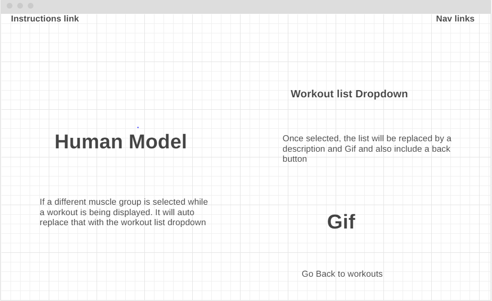

# Fitness Excercise Selector 

In this project, you will be able to interact with a human model, where you can click on different muscle groups 
and it will show exercises and workouts associated with that muscle group. A list of different exercises will appear
which the user can then choose from. Chooseing an excercise will display a video/gif of that excerise along with a description
of how to do it, key notes and takeaways and a reccomended set/rep count. 

## Functionality & MVPs

In Fitness Exercise Selector, users will be able to: 

- View and select different muscle groups from a human model
- See a list of workout and exercise ideas pertaining to that selected muscle group
- View gifs and videos demostrating how to use that workout
- Read descriptions of how to properly perform selected exercise
  
In addition, this project will include:

- An instructions page on how to use the human model and selecting workouts
- A production README

## Wireframes 

- Nav links for Github reop and LinkedIn
- Human model that user can interact with
- Introdution button to help the user in navigating the site

## Technologies, Libraries, APIs

- Webpack and Babel to bundle and transpile the source JavaScritp code
- npm to manage the project dependencies
- a human model API that the user can interact with
- An exercise API to provide a list of different exercises depending on the muscle group 
- A gif API to display a gif of the selected exercise

## Implementation Timeline

- **Friday Afternoon & Weekend:** Setup the project including all of the files and folders. Create the basics of the website including title and background. Implementing human model API along with exercise API
- **Moday:**  Ensuring that human model can be interacted with. Highlight different parts based on what is selected. Connect those part with their respecticve workout names
- **Tuesday:** Creating the templates for the different workouts when selected. Linking the gif API to each workout so the proper gif will display. Adding descriptions to each workout and key notes
- **Wednesday:** Styling the webpage so that the human model will highlight the selected muscle group. Styling each workout popup
- **Thursday:** Deploy final version to Github

